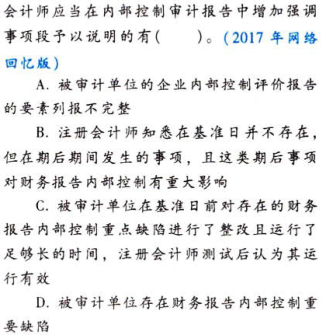

企业内部控制审计.本章真题

# 1. 题目

【答案】
[查看解析和答案](media/6573e26762b695b4da2d50052a4629ae.png.md)
# 2. 题目

【答案】
[查看解析和答案](media/bfaa3e52e90706fa76fa49fec4650017.png.md)
# 3. 题目

【答案】
[查看解析和答案](media/1e7f28aa88174329db52d4954be3519f.png.md)
# 4. 题目

【答案】
[查看解析和答案](media/3af9b48c655a73060a66d1e54cabec44.png.md)
# 5. 题目

【答案】
[查看解析和答案](media/e45c2d82631f58d45364239db979795a.png.md)
# 6. 题目

【答案】
[查看解析和答案](media/0b35aae9e2dcd21810e737a91857ec68.png.md)
# 7. 题目

【答案】
[查看解析和答案](media/6864c31e5f73a4598dc1769da6599f2c.png.md)
# 8. 题目

【答案】
[查看解析和答案](media/f8677d22f52a51269e5bd62c4806436f.png.md)
# 9. 题目

【答案】
[查看解析和答案](media/bfaa245cca7e720f19f4fc4630ab664f.png.md)
# 10. 题目

【答案】
[查看解析和答案](media/d47002c5e38a331b67f42b91dea75298.png.md)
# 11. 题目

【答案】
[查看解析和答案](media/9cdb27a8bd2dea25f30987ebff9ca785.png.md)

