其他特殊项目的审计.本章真题

# 1. 题目

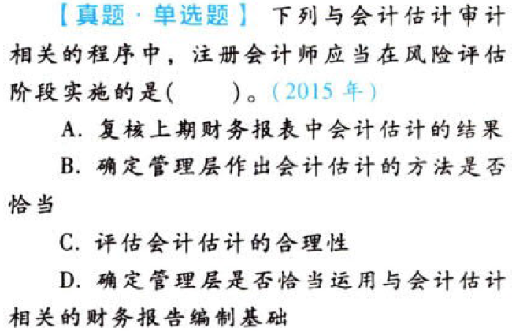

【答案】
[查看解析和答案](media/251b5b1ad19fa9470264a86a7474a2b1.png.md)
# 2. 题目

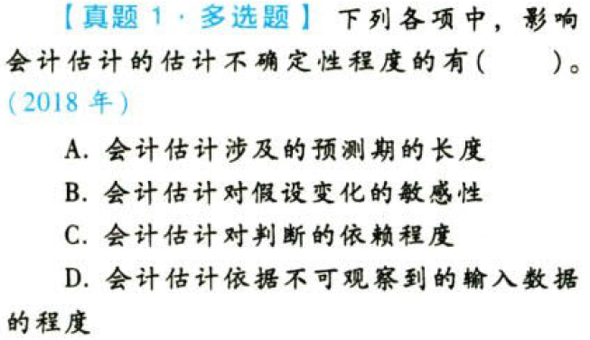

【答案】
[查看解析和答案](media/f82cf6650f51a34c24e0d6bb9999e7b4.png.md)
# 3. 题目

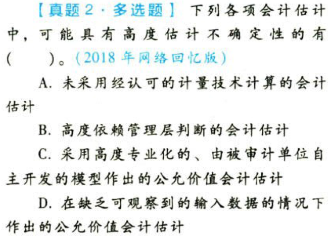

【答案】
[查看解析和答案](media/34ff415764d1a1b3f1d2d136642f3193.png.md)
# 4. 题目

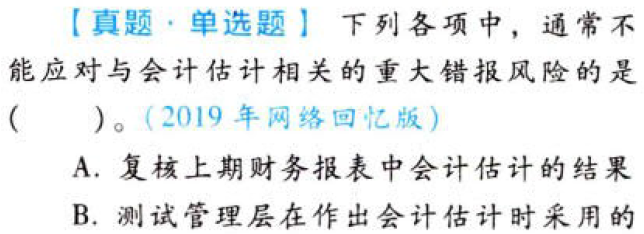

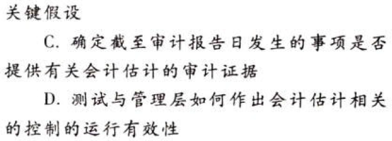

【答案】
[查看解析和答案](media/26e111d69f31849fca0a8373b002ae61.png.md)
# 5. 题目

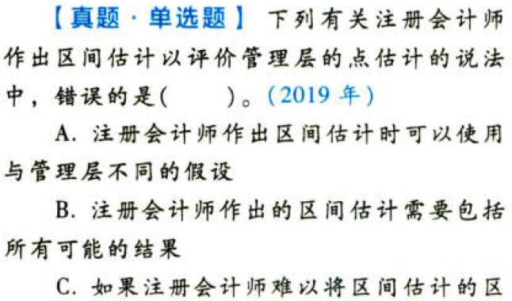

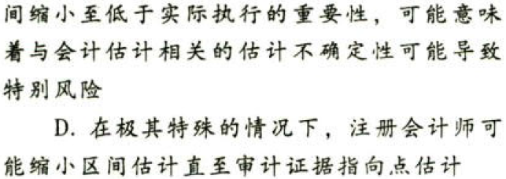

【答案】
[查看解析和答案](media/7bbcccf5988837203edd67248229ba88.png.md)
# 6. 题目

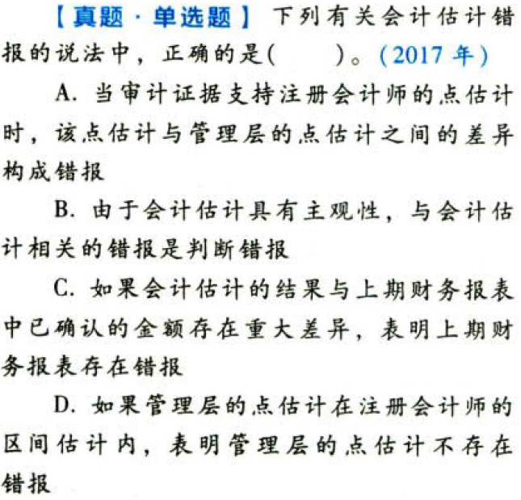

【答案】
[查看解析和答案](media/ed5b05c7fd4e17a87c90db9d6297391e.png.md)
# 7. 题目

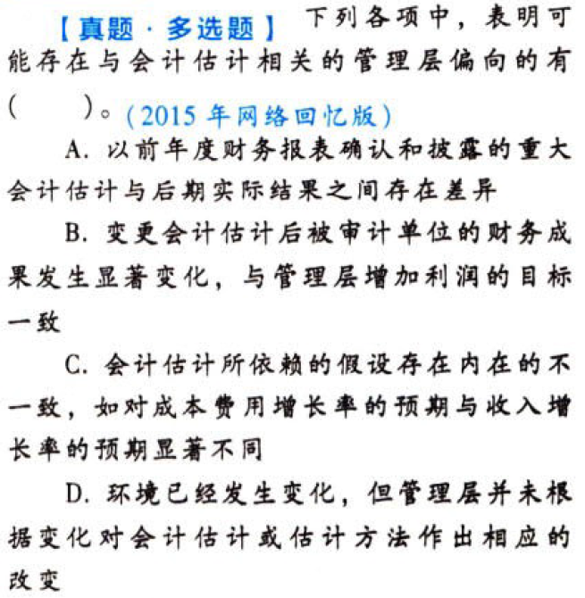

【答案】
[查看解析和答案](media/78fff74211ab1cf9a048dcf6d3134e9b.png.md)
# 8. 题目

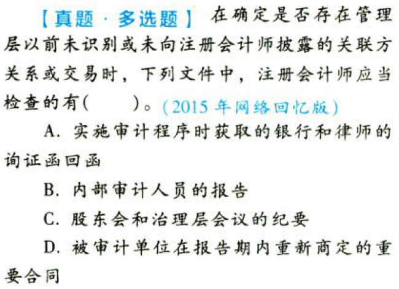

【答案】
[查看解析和答案](media/1578054fde44a3ab125fda9a551ea00c.png.md)
# 9. 题目

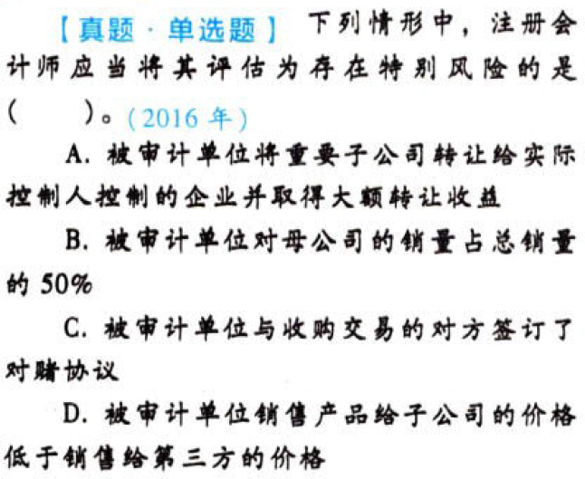

【答案】
[查看解析和答案](media/2541e548ebda2c339047db19df7a6e19.png.md)
# 10. 题目

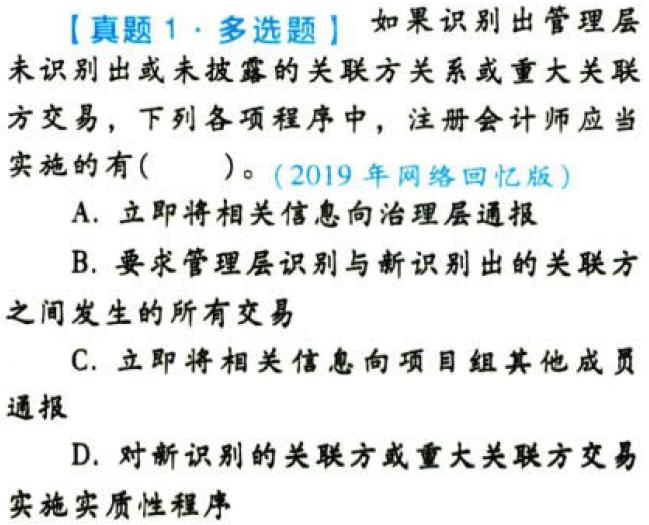

【答案】
[查看解析和答案](media/5f420a583fc26905d714cbee73438a04.png.md)
# 11. 题目

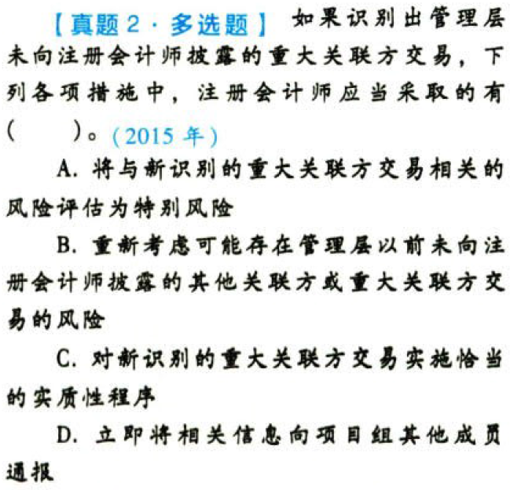

【答案】
[查看解析和答案](media/048b49a15f13ce2e060c41944239da12.png.md)
# 12. 题目

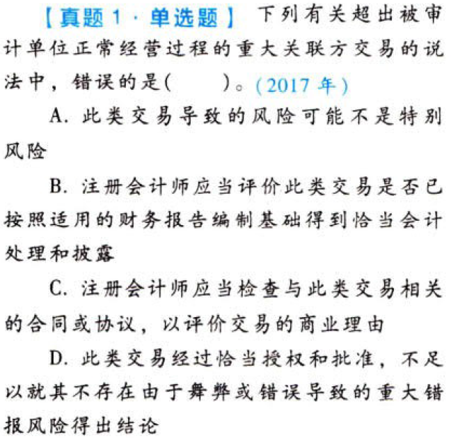

【答案】
[查看解析和答案](media/5e2892b385e566da24dad5258890e7cf.png.md)
# 13. 题目

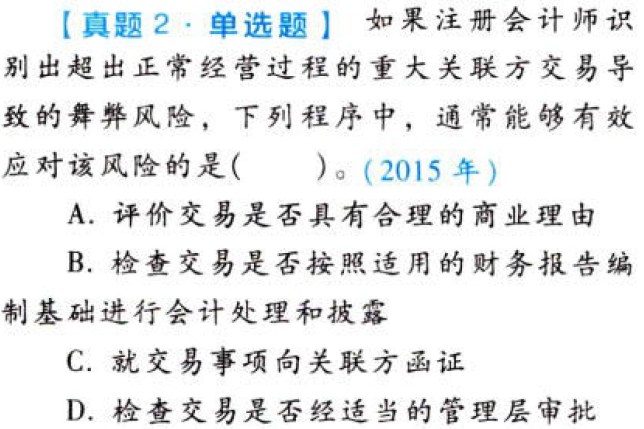

【答案】
[查看解析和答案](media/093baf7705d4b31d5caf39f5db04c3f5.png.md)
# 14. 题目

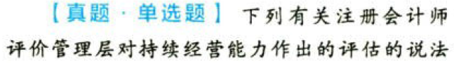

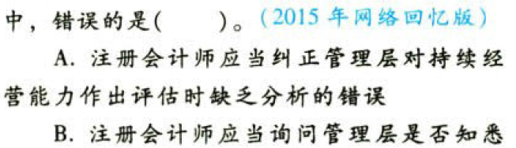

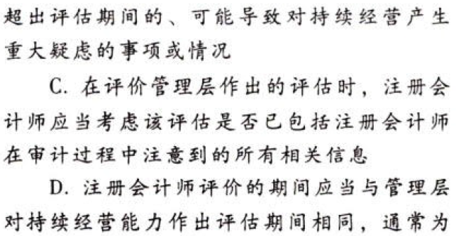

【答案】
[查看解析和答案](media/37b5ea4dcf7fdc0d5b84a001c18ee1b2.png.md)
# 15. 题目

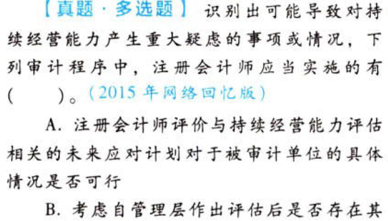

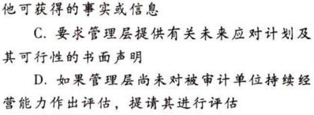

【答案】
[查看解析和答案](media/02006779b41ad6f1b46b1df8baae4795.png.md)
# 16. 题目

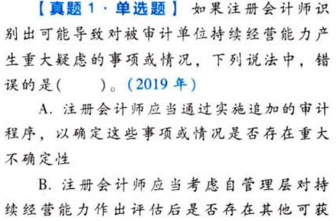

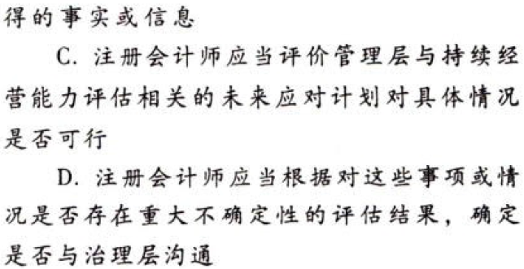

【答案】
[查看解析和答案](media/8d5aa9453f5bf84b95fc475a3a66e581.png.md)
# 17. 题目

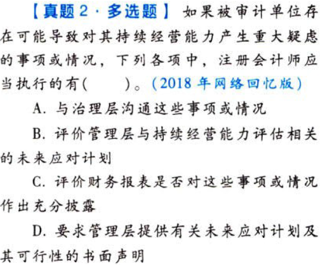

【答案】
[查看解析和答案](media/fc45a6c411ef97058a1c91c0f9378c21.png.md)
# 18. 题目

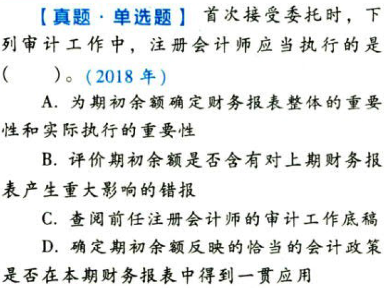

【答案】
[查看解析和答案](media/9a4f2eb3c53f0d0efdc546e040131790.png.md)
# 19. 题目

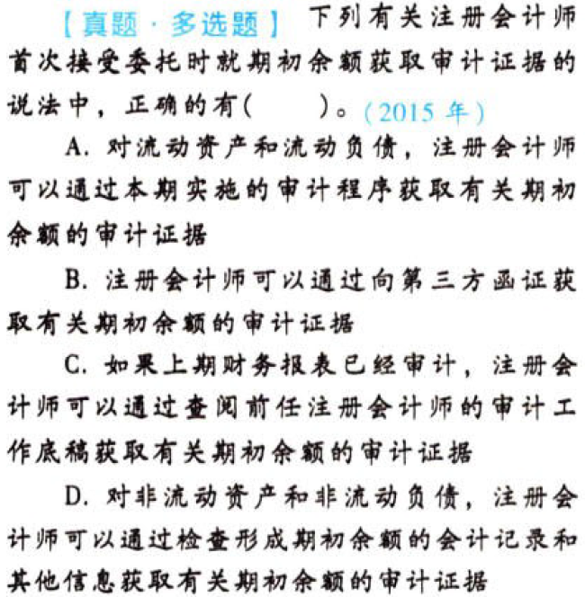

【答案】
[查看解析和答案](media/d559228a2272cad8422ce084abfcf062.png.md)

