完成审计工作.本章真题

# 1. 题目

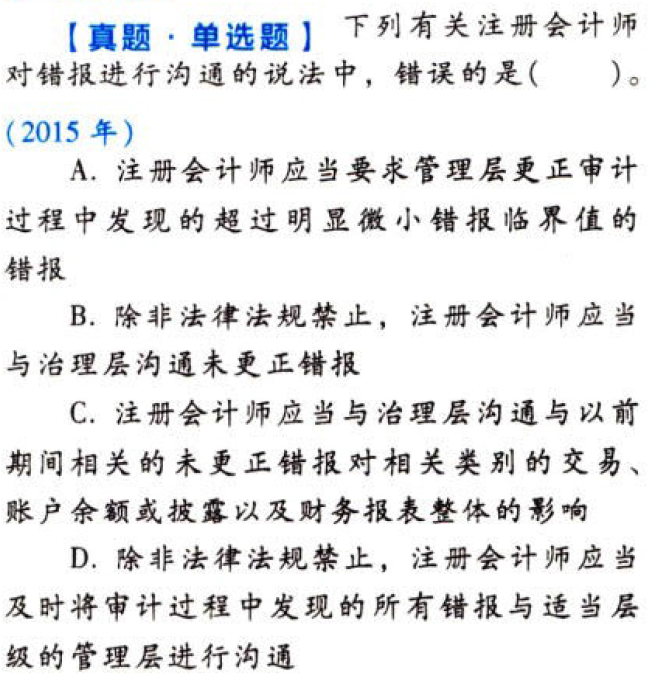

【答案】
[查看解析和答案](media/f59a0f8cc9aa63601c1eef392bf930ce.png.md)
# 2. 题目

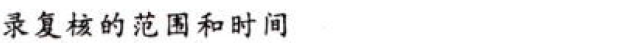

【答案】
[查看解析和答案](media/e3e87e98ec5d33b535ae0dac04236e31.png.md)
# 3. 题目

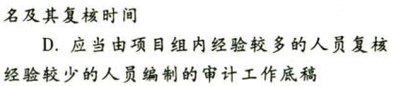

【答案】
[查看解析和答案](media/754aa43e83f4a7053ed4469f904f7a6c.png.md)
# 4. 题目

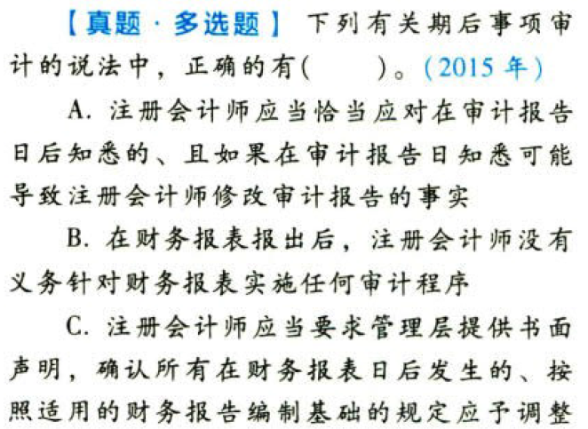

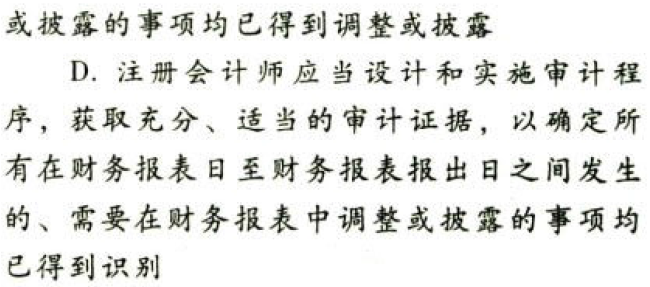

【答案】
[查看解析和答案](media/6209907e5a602957d0910c80dba4761e.png.md)
# 5. 题目

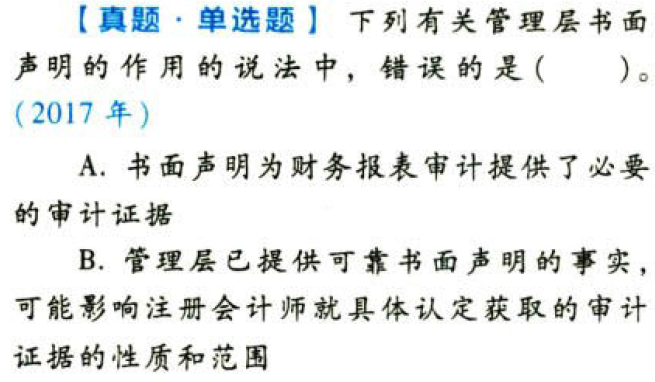

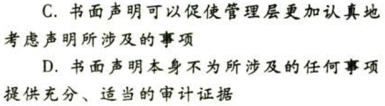

【答案】
[查看解析和答案](media/60200e2d192f28817c7f8da22241c682.png.md)
# 6. 题目

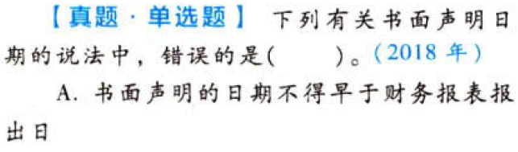

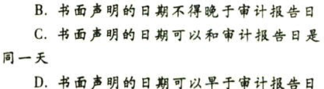

【答案】
[查看解析和答案](media/ee85c2f71ae8f69f69d79436635939c6.png.md)
# 7. 题目

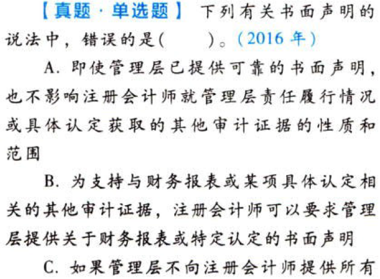

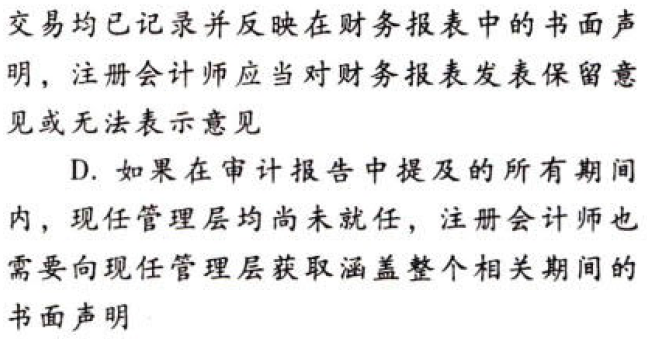

【答案】
[查看解析和答案](media/947f81ec858cb3ed02a5398f2b338bf6.png.md)

