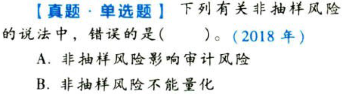

审计抽样方法.本章真题

# 1. 题目

【答案】
[查看解析和答案](media/f2a38bb35f7762469a1b73e5c34a90de.png.md)
# 2. 题目

【答案】
[查看解析和答案](media/18e3cfe571290ae2e402a35fd0573e2c.png.md)
# 3. 题目

【答案】
[查看解析和答案](media/58d8eedec1fdb98dbbd559732f1d3a06.png.md)
# 4. 题目

【答案】
[查看解析和答案](media/c4e4d61b17cb0133339c0cbc4c2cbc98.png.md)
# 5. 题目

【答案】
[查看解析和答案](media/72046c5d204ff20cf79d7e22ebd6b6c0.png.md)
# 6. 题目

【答案】
[查看解析和答案](media/f3676da4feca2d8fe2a2d60fd1da4c4a.png.md)
# 7. 题目

【答案】
[查看解析和答案](media/3ee4b6a81531c8c12016fb7de6aa9fe8.png.md)
# 8. 题目

【答案】
[查看解析和答案](media/8d8a2af937e48be0817f07ce8e8de9ac.png.md)
# 9. 题目

【答案】
[查看解析和答案](media/3c5a56339a2cf11457c056611a3b9431.png.md)
# 10. 题目

【答案】
[查看解析和答案](media/1b44646e0db1c3d6d9c60eecc7bea4c0.png.md)
# 11. 题目

【答案】
[查看解析和答案](media/c41d0f696a9eab262ec7137b9a064332.png.md)
# 12. 题目

【答案】
[查看解析和答案](media/debb7623d0e19474945c7590be8cca7f.png.md)

