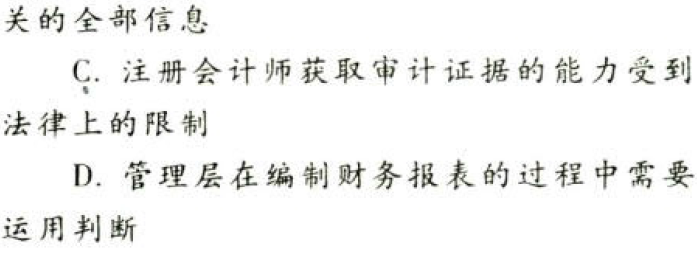

审计概述.本章真题

# 1. 题目

【答案】
[查看解析和答案](media/b6c157d94c69e3c99fac94f56b1dfe42.png.md)
# 2. 题目

【答案】
[查看解析和答案](media/afeb5b73d0de03a7c25bf276e3512b49.png.md)
# 3. 题目

【答案】
[查看解析和答案](media/0012e855016630427ec6e2f9fcadac36.png.md)
# 4. 题目

【答案】
[查看解析和答案](media/e2cff22ee74371f2d6823dac28fc3eb5.png.md)
# 5. 题目

【答案】
[查看解析和答案](media/7e38ff686268266a7a2bfdef38c590c7.png.md)
# 6. 题目

【答案】
[查看解析和答案](media/62a14b6640fabef709bb0907b7bae802.png.md)
# 7. 题目

【答案】
[查看解析和答案](media/5f3cc3f983c67fa223fe32f82223c767.png.md)
# 8. 题目

【答案】
[查看解析和答案](media/5dcee9b7a054ef3990684f2e88a72333.png.md)
# 9. 题目

【答案】
[查看解析和答案](media/5e8f838839bc5ab5460b9908f1022b01.png.md)
# 10. 题目

【答案】
[查看解析和答案](media/0b252fdf01acf37e3c6227fd90b18fba.png.md)
# 11. 题目

【答案】
[查看解析和答案](media/c57610ed2bd0ff907f6047580057f321.png.md)
# 12. 题目

【答案】
[查看解析和答案](media/26acc27b009578fb9397546c6ba957e4.png.md)
# 13. 题目

【答案】
[查看解析和答案](media/9033f554664ad242834f305d6fd38c82.png.md)
# 14. 题目

【答案】
[查看解析和答案](media/f0adaf0601a2f60579a4a5fbc2527f0c.png.md)

