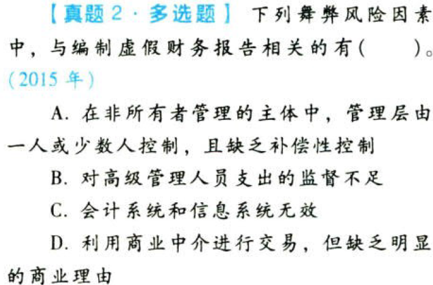

对舞弊和法律法规的考虑.本章真题

# 1. 题目

【答案】
[查看解析和答案](media/10f4b5f4ffece62a96b8f9168006c537.png.md)
# 2. 题目

【答案】
[查看解析和答案](media/2d6f4c0c4a681cd650cc67b286514b9e.png.md)
# 3. 题目

【答案】
[查看解析和答案](media/b618a4255e03013f164c587bc195aac7.png.md)
# 4. 题目

【答案】
[查看解析和答案](media/955d29352cd9bad0154c7a0778b91405.png.md)
# 5. 题目

【答案】
[查看解析和答案](media/643c5f4dad4b7c5cc516ae275b0217d1.png.md)
# 6. 题目

【答案】
[查看解析和答案](media/58322f9d1d6b89cbd93fdbb75fa4f71e.png.md)
# 7. 题目

【答案】
[查看解析和答案](media/d9982beee617ddda2c8cce5f9eb62278.png.md)
# 8. 题目

【答案】
[查看解析和答案](media/62893221307cdc76d568bc1850a5240e.png.md)
# 9. 题目

【答案】
[查看解析和答案](media/8b942de1a477a7691a7d0bf0fa8c177a.png.md)
# 10. 题目

【答案】
[查看解析和答案](media/1f0527cbb06d725cf016d8be472e9def.png.md)
# 11. 题目

【答案】
[查看解析和答案](media/7b8b18acfacd37c15f3c6aa10c625d48.png.md)
# 12. 题目

【答案】
[查看解析和答案](media/b35f4cdf8a6fe6cc20594dd2bffa65d3.png.md)
# 13. 题目

【答案】
[查看解析和答案](media/6ed0daf07fb14055998a17c700453b45.png.md)
# 14. 题目

【答案】
[查看解析和答案](media/ec1d9262af0a92bcd0657b70bf6b9be0.png.md)

