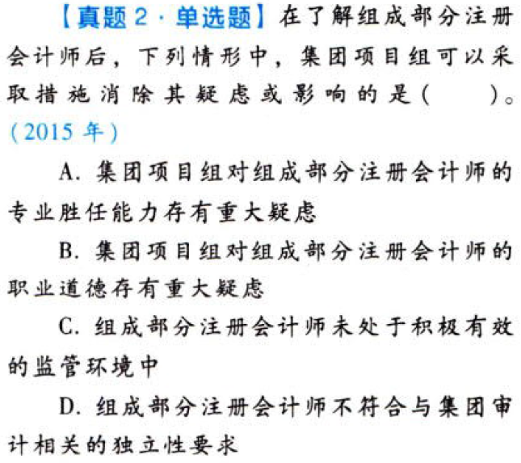

对集团财务报表审计的特殊考虑.本章真题

# 1. 题目

【答案】
[查看解析和答案](media/26010d303d97dcfe20559dbec5993e6b.png.md)
# 2. 题目

【答案】
[查看解析和答案](media/875b5ed8296f2d3859d4dd7e18e23a1d.png.md)
# 3. 题目

【答案】
[查看解析和答案](media/78523002b8a24343a2e729c9ee24735c.png.md)
# 4. 题目

【答案】
[查看解析和答案](media/75828095fbf52d21feb9f500cc036f0b.png.md)
# 5. 题目

【答案】
[查看解析和答案](media/e124c197f675126b067da8eed299705a.png.md)
# 6. 题目

【答案】
[查看解析和答案](media/89fa99d5b1ffd34bf188b925c6129c1b.png.md)
# 7. 题目

【答案】
[查看解析和答案](media/78abd58c9198736c2bdfda8a63b7b871.png.md)

