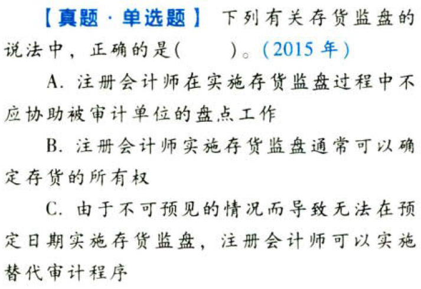
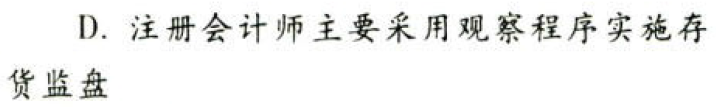
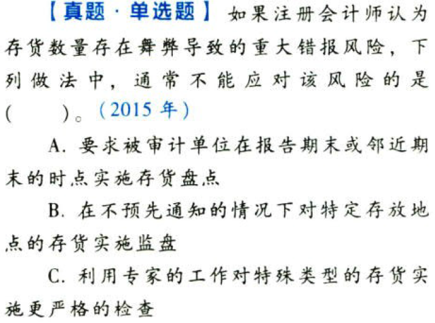
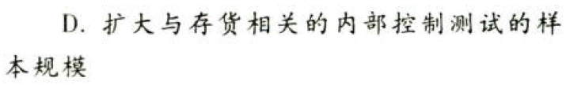
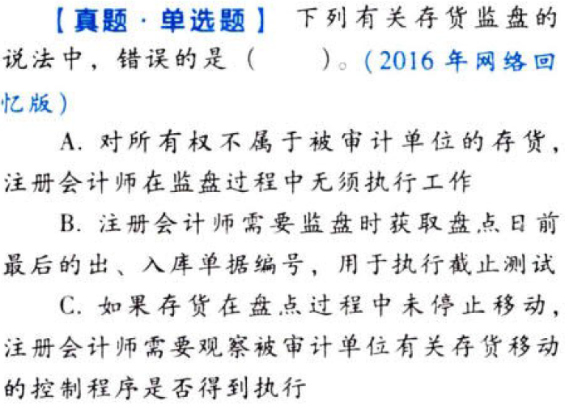
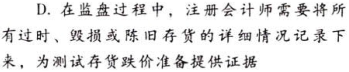

生产与存货循环的审计.本章真题

# 1. 题目

【答案】
[查看解析和答案](media/af52023eba0cee4b1835eaaf7989d772.png.md)
# 2. 题目

【答案】
[查看解析和答案](media/14282211699bd8c2f206d4bb0913df48.png.md)
# 3. 题目

【答案】
[查看解析和答案](media/0ec5ad647d84a6c231bd46c7b1adb23e.png.md)

