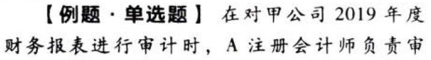
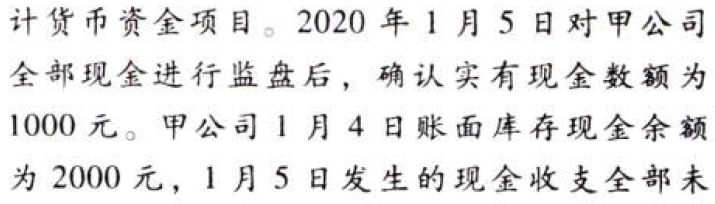
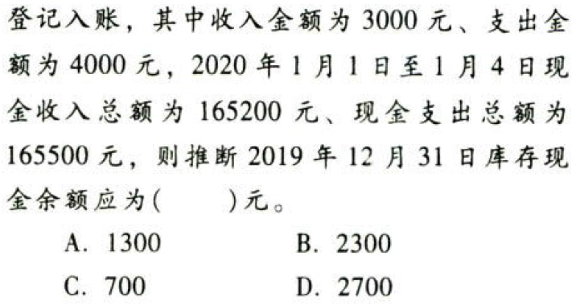
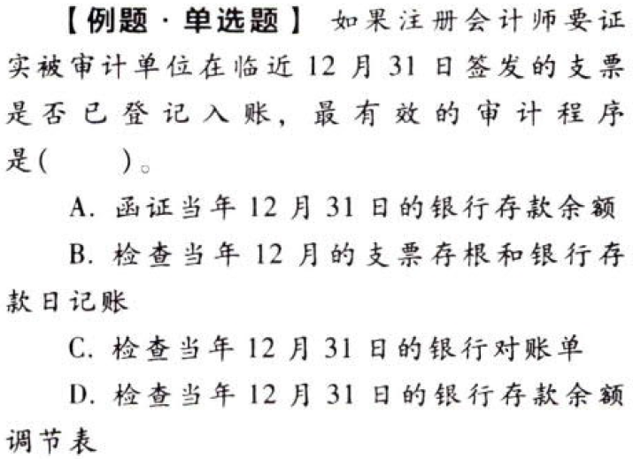
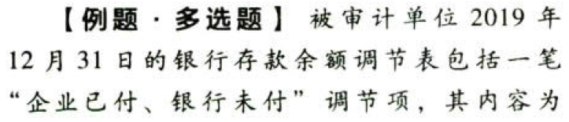
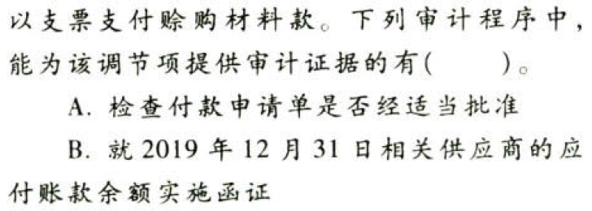
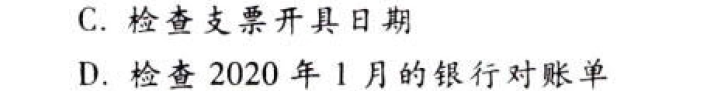
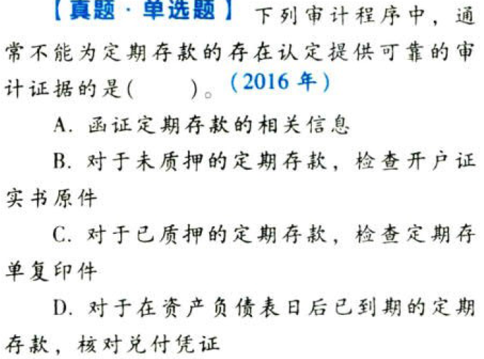

货币资金的审计.本章真题

# 1. 题目

【答案】
[查看解析和答案](media/4f231f64938a294328b565f58051e681.png.md)
# 2. 题目

【答案】
[查看解析和答案](media/5a0523132ff235efeca49e800d6c7fcc.png.md)
# 3. 题目

【答案】
[查看解析和答案](media/3964e62251bcc97912e4f84d2a7954bc.png.md)
# 4. 题目

【答案】
[查看解析和答案](media/bc15de71ad95011d21d8c2dacf74b08c.png.md)

