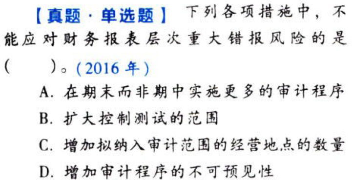
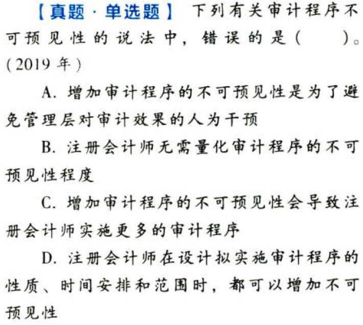
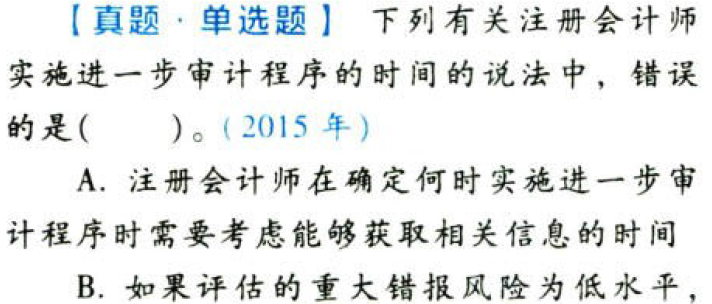
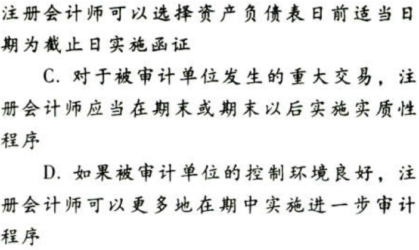
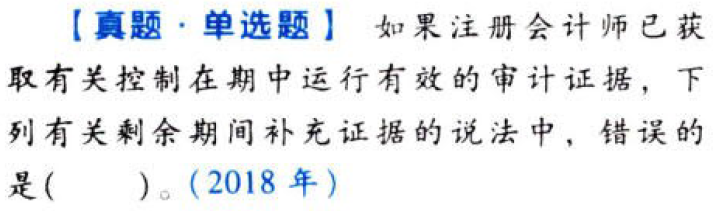
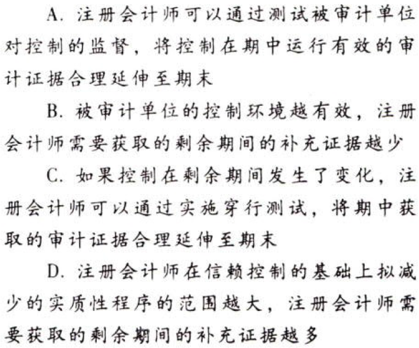
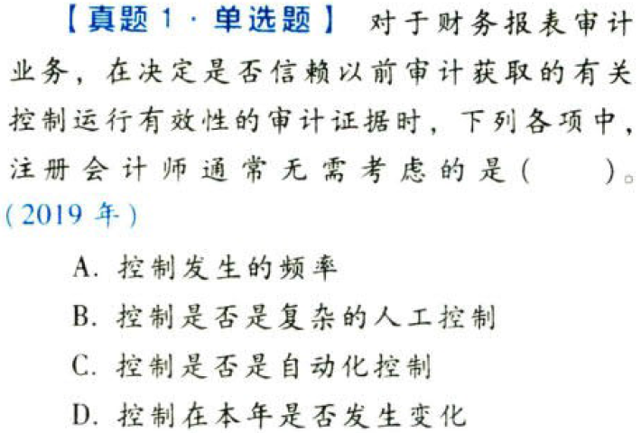
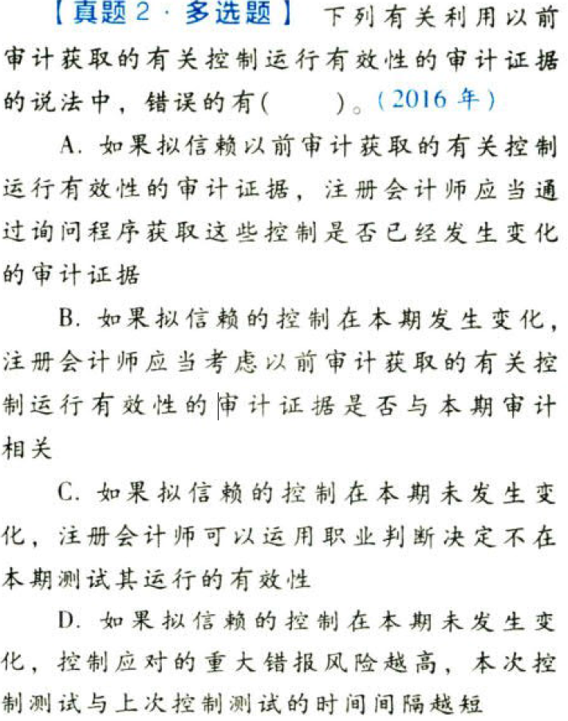
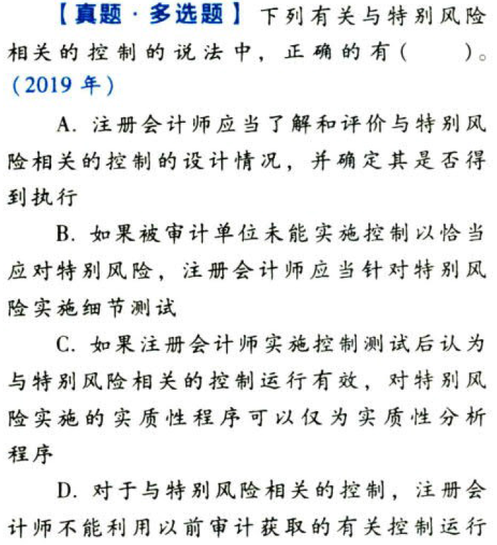
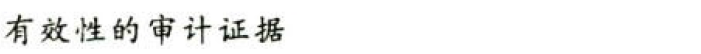

风险应对.本章真题

# 1. 题目

【答案】
[查看解析和答案](media/6bb2b01f1eebfc1c453b1c18b2c10a35.png.md)
# 2. 题目

【答案】
[查看解析和答案](media/103079e59638b5cca9436285c88e17ba.png.md)
# 3. 题目

【答案】
[查看解析和答案](media/bea9c6fff0689406bfe3f292b6eabe18.png.md)
# 4. 题目

【答案】
[查看解析和答案](media/6de431192f91201eb65f86b3c580b970.png.md)
# 5. 题目

【答案】
[查看解析和答案](media/25157aeffaf708de0bf20cdda0c1bd8f.png.md)
# 6. 题目

【答案】
[查看解析和答案](media/85b28c6eee79f0db6aa46c4ed8138947.png.md)
# 7. 题目

【答案】
[查看解析和答案](media/ccd7981ce418ca51d947ef3f5a4965a8.png.md)

