风险评估.本章真题

# 1. 题目

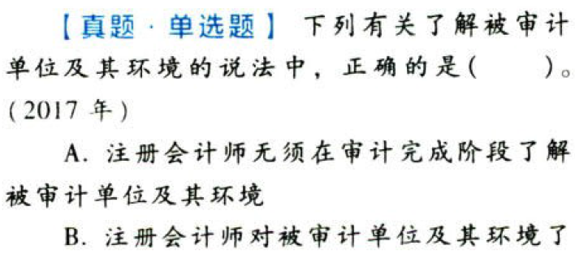

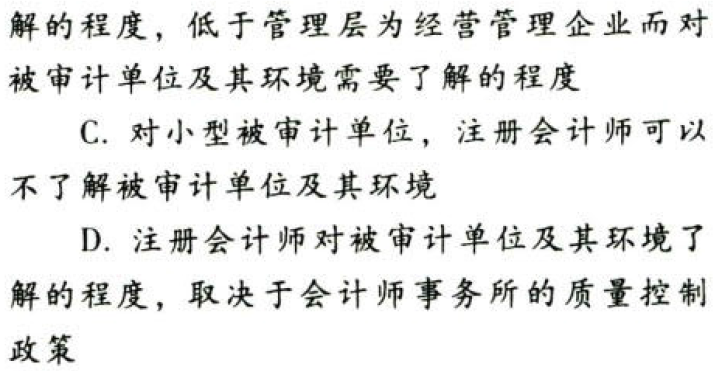

【答案】
[查看解析和答案](media/133684e8842e6effed167cefa40d1575.png.md)
# 2. 题目

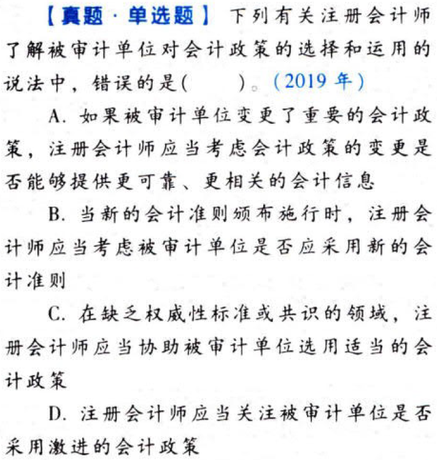

【答案】
[查看解析和答案](media/0fa98e6b69457cb6406f5b1dc1d8635f.png.md)
# 3. 题目

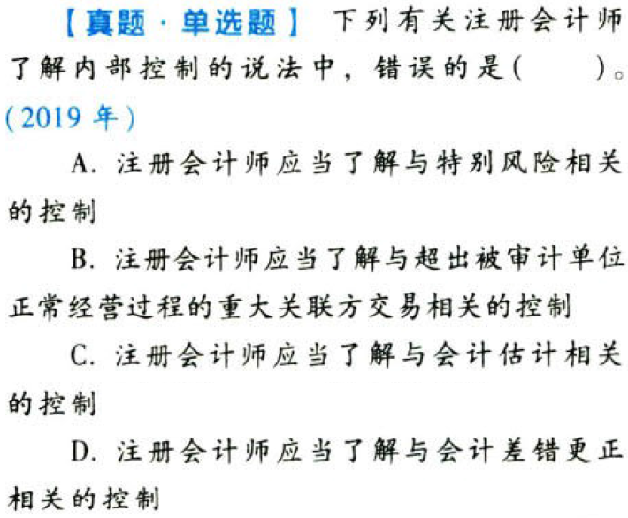

【答案】
[查看解析和答案](media/44aa06a531e075181511a4fd54303d33.png.md)
# 4. 题目

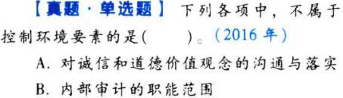

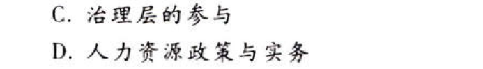

【答案】
[查看解析和答案](media/8cc947ba5f2899b11f6994fe6013f6af.png.md)
# 5. 题目

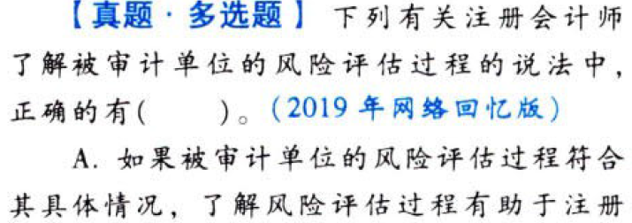

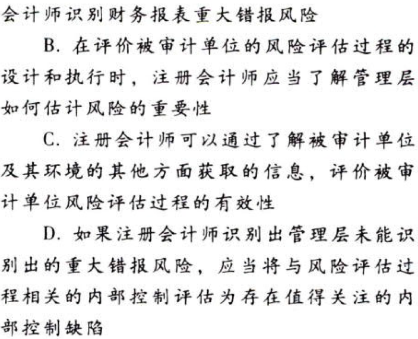

【答案】
[查看解析和答案](media/77788374fc8c5ca22f40b880233cb58b.png.md)
# 6. 题目

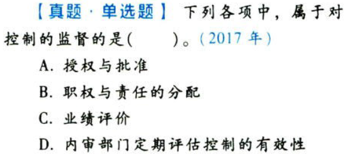

【答案】
[查看解析和答案](media/0c0c7028201bf72b74b862997c38e3d5.png.md)
# 7. 题目

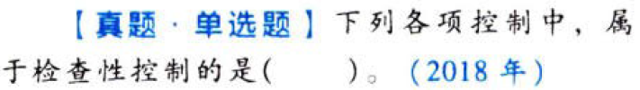

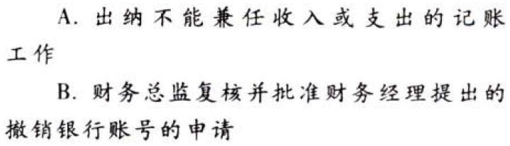

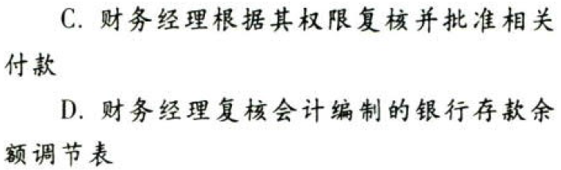

【答案】
[查看解析和答案](media/304eae83a0e24a3c76bad6b73ab3845f.png.md)
# 8. 题目

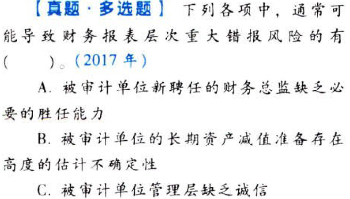

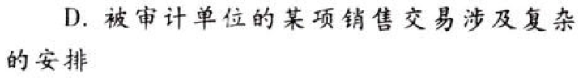

【答案】
[查看解析和答案](media/279d5d3a10d694261d73a4061e111de5.png.md)
# 9. 题目

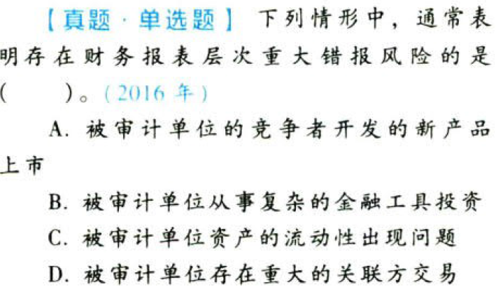

【答案】
[查看解析和答案](media/a952a828116fe453a9eac6985cc8e1e5.png.md)
# 10. 题目

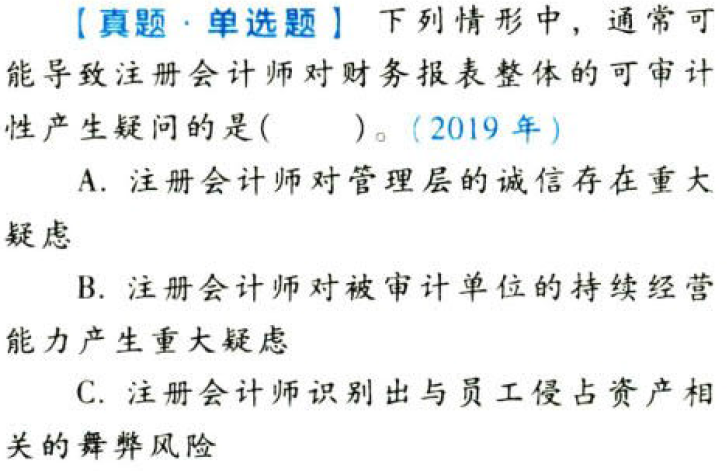

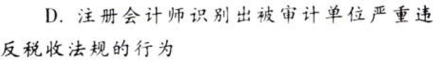

【答案】
[查看解析和答案](media/bb3c3493876a45d373448b206a8adb31.png.md)
# 11. 题目

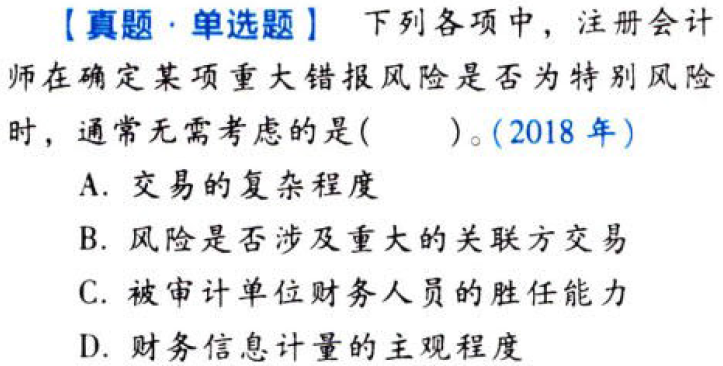

【答案】
[查看解析和答案](media/e5faad0b78a96a607aad410555436c03.png.md)

